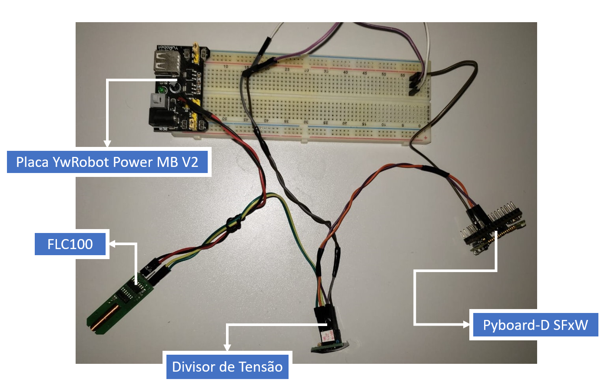

# Diretório de códigos públicos

Neste diretório estão os códigos mais recentes para visualização de resultados do projeto "Uso de magnetômetros fluxgate e MEMS em projetos com MicroPython, Edge Computing e IoT". Códigos de análise e envio de dados disponíveis em [PYB_FLC100_EdgComp](https://github.com/EduardoDestefani/micropython-samples/tree/master/Codigo-fonte/MicroPython/Pyboard%20D-Series/PYB_FLC100_EdgComp) e [PYB_FLC100_IoT](https://github.com/EduardoDestefani/micropython-samples/tree/master/Codigo-fonte/MicroPython/Pyboard%20D-Series/PYB_FLC100_IoT), respectivamente.

## PortMag
Versão mais recente do pré-protótipo "PortMag" :

