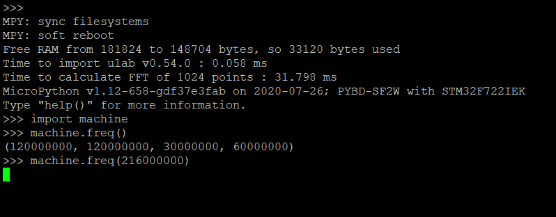

## Bug do Pyboard-D SF2W via under-overclocking (36-216 MHz)

### Problema

Depois de testado várias vezes a função [`machine.freq()`](https://docs.micropython.org/en/latest/library/machine.html?highlight=machine%20freq#machine.freq) e [`pyb.freq()`](https://docs.micropython.org/en/latest/library/pyb.html?highlight=pyb%20freq#pyb.freq) com êxito, durante as medidas dessa semana, me deparei com a incapacidade do [Pyboard-D SF2W](https://store.micropython.org/product/PYBD-SF2-W4F2) em mudar seu clock para frequências superiores e inferiores a 120 MHz (ou seja, todas as faixas de frequência exceto a default). Mesmo mudando de sistema operacional (Windows e Linux Mint) e reinstalando o firmware o bug persistia.

O bug consiste no travamento do REPL ou do Pyboard-D quando executado o comando `machine.freq(_num_da_frequência_)` ou `pyb.freq(_num_da_frequência _)`. Vide imagem abaixo. Para interromper o erro, apenas desconectando ou resetando o Pyboard-D foi eficaz.

Processos de reinstalação de firmware não foram eficazes para solucionar o bug. Foram instalados 4 firmwares, 2 com ulab (sp e dp v0.54.0) e 2 oficiais ([PYBD-SF2-20191220-v1.12.dfu](https://micropython.org/download/pybd/) e [PYBD-SF2-20200802-unstable-v1.12-662-g8da40baa4.dfu](https://micropython.org/download/pybd/)), todos tiveram o mesmo problema.

### Solução

A solução foi bem simples, mas resolveu parcialmente o problema. Consegui mudar a frequência de 120 para 216 MHz e 120 para 36 MHz. Contudo, não consigo realizar essa operação repetidas vezes sem precisar resetar. Ou seja, consigo mudar seu clock apenas uma vez, caso contrário ele volta a bugar, precisando reseta-lo (Pressionar botão RST, ou desligar e ligar) para voltar a funcionar.

Para tal é necessário executar o **factory reset**, uma função manual do Pyboard-D que consiste em; "Try holding down the USR switch and reset. Release reset. Release USR when the light is blue to do a factory reset of your flash." (Tente manter pressionada a chave USR e RST. Solte RST. Libere USR quando a luz estiver azul para fazer uma redefinição de fábrica do flash). Após tal ação, consegui executar o comando novamente.
